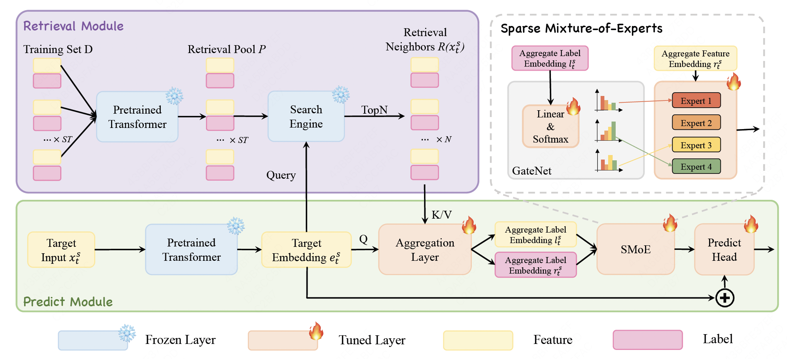

# [WWW2025: Mixture of Experts with Retrieval-Augmented Representation for Modeling Diversified Stock Patterns]

This repository contains the official implementation of our WWW 2025 paper:  
[[Mixture of Experts with Retrieval-Augmented Representation for Modeling Diversified Stock Patterns]](https://dl.acm.org/doi/10.1145/3701716.3715513) 

## 📌 Abstract

Successful quantitative investment relies on accurate predictions of the future stock price. Deep learning-based solutions have recently demonstrated a superior ability to capture the intricate and nonlinear interactions among various market variables. However, most existing methods use the same parameters to fit all samples, without considering that the real stock market often exhibits multiple patterns. To alleviate this issue, we propose a novel module called Mixture of Experts with Retrieval-Augmented Representation (MERA). Essentially, MERA consists of a set of independent experts for differentiated modeling as well as a GateNet that dynamically allocates data of different patterns to the most suitable experts. The model backbone is responsible for learning the coarse-grained representations for all stock patterns. Then, each expert in the MERA module focuses on the specific pattern and performs a more fine-grained analysis. However, accurate data allocation remains challenging due to the lack of explicit pattern identifiers. To overcome this, MERA retrieves relevant samples using high-level representations from self-supervised pre-training. The label information of neighbor samples is promising discriminative signals to indicate the target stock pattern. Extensive experiments on real-world stock markets show significant improvements

## 📌 Overview




## 📌 Citation

```bibtex
@inproceedings{10.1145/3701716.3715513,
author = {Liu, YuJun and Song, Chen-Hui and Liu, Peiyuan and Li, Naiqi and Dai, Tao and Bao, Jigang and Jiang, Yong and Xia, Shu-Tao},
title = {MERA: Mixture of Experts with Retrieval-Augmented Representation for Modeling Diversified Stock Patterns},
year = {2025},
booktitle = {Companion Proceedings of the ACM on Web Conference 2025},
pages = {1148–1152},
numpages = {5},
keywords = {mixture of expert, retrieval-augmented representation, stock prediction},
location = {Sydney NSW, Australia},
series = {WWW '25}
}
